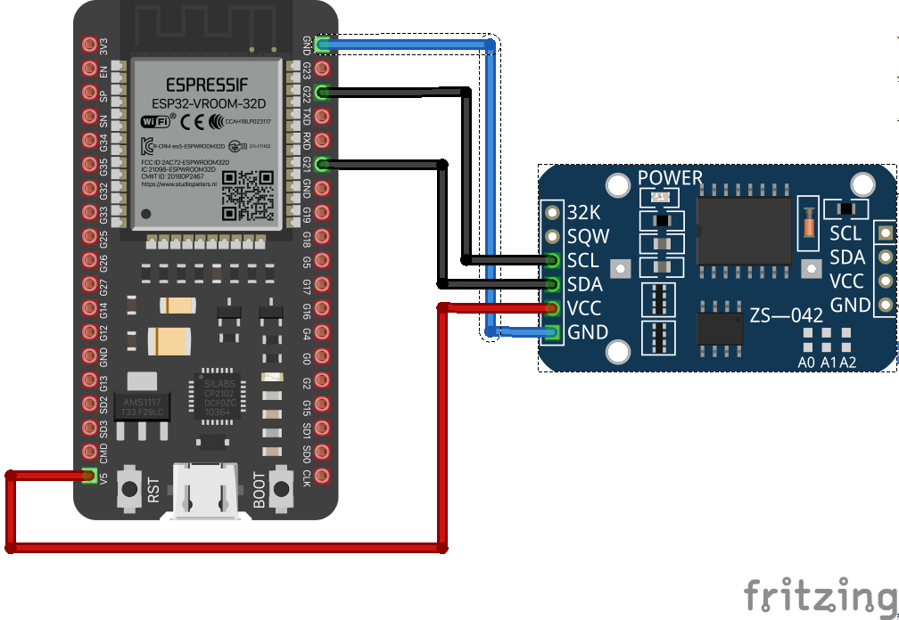

## Podstawowy szablon dla projektów.

### Zaimplementowane:
1. WiFi
    - Klient wifi łączy się do wcześniej zdefiniowanej sieci lub
tworzy własną sieć **InitWifi**.
    - Co 60 sekund sprawdzane jest połącznie z wifi.
2. RTC 
    - Szablon wykorzystuje wewnętrzny zegra RTC lub po podłączeniu zewnętrzny. 
    - Co 60 minut następuję aktualizacja zegara z NTP, jeżeli jest zdefiowany. 
    - Odczyt czasu z RTC jest 2 razy na sekundę.
    - dla czasu lokalnego można ustawić korektę czasu letniego dla sterfy CET. 
3. NTP
4. MQTT
    - klient łączy sie tylko przez protokół TLS, bez sparwdzania certyfikatu.
    - co 30 sekund sprawdzane jest połącznie z serwerem mqtt.
5. Serwer HTTP
    - udostępnia stronę do konfiguracji na porcie 80.
6. Konsola
    - konsola do odczytów logów
    - w procedurze `konsolaKomenda()` można zdefiniować własne komendy.
7. OTA

Cały program chodzi na core0, konfiguracja zapisywana jest na wewnetrznym systemie plików SPIFFS.

### Schemat połączeń.

### Linki
1. Odczyty NTP [https://randomnerdtutorials.com/epoch-unix-time-esp32-arduino/](https://randomnerdtutorials.com/epoch-unix-time-esp32-arduino/)
2. Zmiana czasu EPOCH na ludzki [https://www.geeksforgeeks.org/convert-unix-timestamp-to-dd-mm-yyyy-hhmmss-format/](https://www.geeksforgeeks.org/convert-unix-timestamp-to-dd-mm-yyyy-hhmmss-format/)
